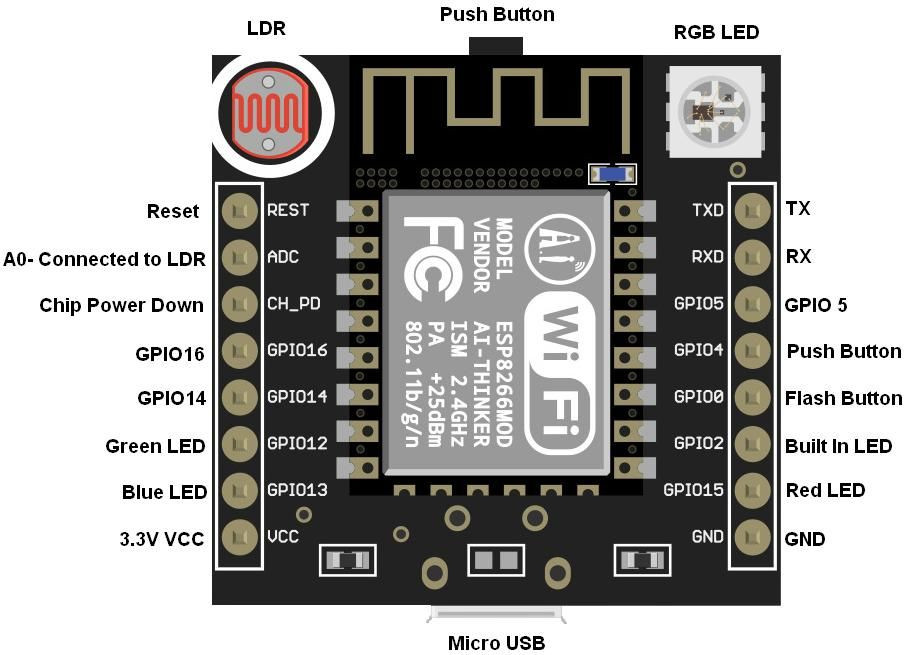

l2# ESP2286-Arduino

Es este repositorio se documentara los conocimeintos que se adquieran en hardware y software de esp8266 y arduino.

- esp8266 estoy utilizando los módulos: mini nodeMCU witty cloud.

- En software estoy utlizando Micropython. 

  Lo primero que se debe realizar es cargar el firmware en la placa para lo cual recomiento utlizar como guía:
  
  https://www.prometec.net/micropython-nodemcu/# (Español)
  
  https://randomnerdtutorials.com/flash-upload-micropython-firmware-esp32-esp8266/ (Inglés)
  
  26/11/2018
  
  Creación de un servidor web con micropython para encender y apagar el led de la placa witty cloud.
  
  27/11/2018
  
  Imagen de entradas y salidas de la placa witty cloud
  
   
  
  

    LED RGB: El segmento G (Verde) está conectado al pin 12 GPIO, el segmento B (Azul) al pin 13 y el R (Rojo) al pin 15. Un llamado ‘digitalWrite()’, previo a su declaración como OUTPUTS, es más que suficiente para activarlos.

    LDR: Esta fotoresistencia ya está acondicionada en placa y ocupa el único convertidor análogo a digital (ADC) de nuestro ESP8266, es decir, A0,. La función de Arduino ‘analogRead()’ nos permitirá conocer la lectura del sensor al devolvernos un número en el rango de 0 – 1023 (10 Bits) donde 0 es oscuridad/penumbra y 1023 es máxima iluminación.

    Push Button: Conectado al GPIO4, podemos, previo a su declaración como INPUT, leer su estado con digitalRead() .

Tomado de: https://espofthings.wordpress.com/2017/12/07/como-configurar-witty-cloud-board-esp8266-y-testear-perifericos/

Segundo proyecto

Parte del código fue consultado en https://github.com/pythoncanarias/upython#pinout-del-nodemcu

La placa incorpora el led RGB WS2812. El segundo proyecto consiste en hacer que el led encienda y apagague cada uno de los colores: Rojo, Verde y Azul cada luz estara encendida medio segundo la serie se repetira 5 veces. 

Tercer proyecto

Parte de código fue consultado en https://learn.adafruit.com/micropython-hardware-digital-i-slash-o/overview

La placa incorpora un botón. EL tercer proyecto consiste en encender y apagar el led verde utilizando el boton incorporado de la placa.

Cuarto proyecto

Entrada Analógica - Salida Analógica
La placa incorpora un fotoresitor. El cuarto proyecto consiste en utlizar la fotoresistencia y de acuerdo a ello que el led incorporado verde brille mas o menos.
